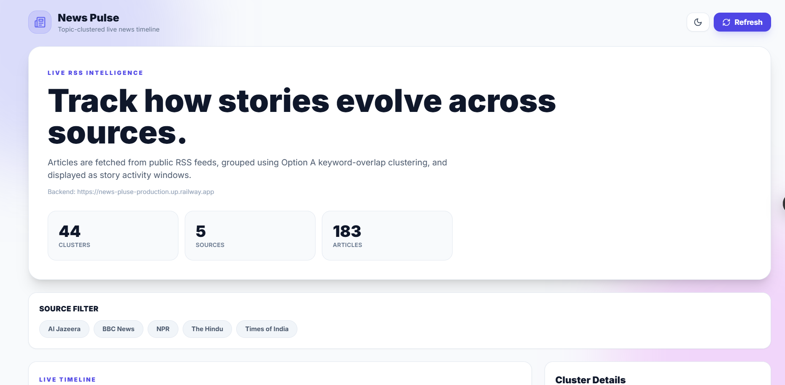

# 📰 News Pulse – Topic Clustered News Timeline

A full-stack news intelligence application that collects live articles from multiple RSS feeds, groups related news into topic clusters using keyword-overlap clustering, and visualizes them on an interactive timeline.

Developed as part of the **Xponentium Full Stack Developer Internship Assessment**.

---

## 🚀 Live Demo

### Frontend
https://news-pluse-red.vercel.app

### Backend API
https://news-pluse-production.up.railway.app

### GitHub Repository
https://github.com/Kommagayathri/News-pluse

### Video walkthrough
https://drive.google.com/file/d/1KDYUv8D4cmEHY9HibqWta1iJ_tAos8fH/view?usp=sharing

---

# 📸 Screenshots


## 🌙 Dashboard (Dark Mode)

The main dashboard displaying live news statistics, source filters, refresh functionality, and topic overview.


---

## 📅 Timeline Visualization

Interactive timeline showing topic clusters across their active time windows. Clicking a cluster opens detailed information about the related news articles.


---

## 📰 Top Stories & Cluster Details

Displays all articles within a selected topic cluster, including the source, publication time, summary, and link to the original news article.


---

## ☀️ Dashboard (Light Mode)

The application also supports a clean, responsive light theme for improved readability.



---

---

# 🛠 Tech Stack

### Frontend
- React (Vite)
- Tailwind CSS
- Recharts
- Lucide React

### Backend
- Node.js
- Express.js
- PostgreSQL

### Python Pipeline
- feedparser
- trafilatura
- newspaper3k
- BeautifulSoup
- psycopg2

### Database
- Neon PostgreSQL

### Deployment
- Vercel
- Railway
- Neon

---

# 🏗 Architecture

```
RSS Feeds
      │
      ▼
Python Scraper
      │
Extract Full Articles
      │
Normalize Content
      │
Keyword Overlap Clustering
      │
Store Data
      │
Neon PostgreSQL
      │
Node.js REST API
      │
React Frontend
```

---

# ✨ Features

- Live RSS news ingestion
- Topic clustering
- Timeline visualization
- Cluster detail view
- Source filtering
- Refresh pipeline
- Responsive UI
- Dark / Light mode
- PostgreSQL storage
- REST APIs

---

# 📰 RSS Sources

- BBC News
- NPR
- The Hindu
- Al Jazeera
- Times of India

---

# 🧠 Topic Grouping Approach

This project uses **Option A – Keyword Overlap Clustering**.

### Steps

1. Convert article text to lowercase.
2. Remove stop words.
3. Extract meaningful keywords.
4. Compare keyword overlap.
5. Group similar articles.
6. Generate cluster labels.

### Why this approach?

Keyword overlap is lightweight, explainable, and performs well for breaking news without requiring machine learning.

---

# ⚙ Threshold Selection

Articles are grouped when they share multiple significant keywords after preprocessing.

The threshold was selected experimentally to reduce unrelated groupings while maintaining cluster quality.

---

# ⚠ Limitation

Keyword matching cannot always identify stories that discuss the same event using very different wording.

Future improvements include:
- TF-IDF
- Sentence Embeddings
- Semantic Search

---

# 🌐 API Endpoints

| Method | Endpoint | Description |
|---------|----------|-------------|
| GET | `/timeline` | Timeline formatted clusters |
| GET | `/clusters` | List all clusters |
| GET | `/clusters/:id` | Cluster details |
| POST | `/ingest/trigger` | Trigger scraper |
| GET | `/ingest/status/:jobId` | Pipeline status |

---

# 📂 Project Structure

```
News-pluse/
│
├── frontend/
│   ├── src/
│   ├── components/
│   └── lib/
│
├── backend/
│   ├── src/
│   └── routes/
│
├── scraper/
│   ├── adapters/
│   ├── clustering/
│   ├── db/
│   └── extractors/
│
└── README.md
```

---

# ⚡ Local Setup

## Clone Repository

```bash
git clone https://github.com/Kommagayathri/News-pluse.git

cd News-pluse
```

## Backend

```bash
cd backend

npm install

npm run dev
```

## Frontend

```bash
cd frontend

npm install

npm run dev
```

## Scraper

```bash
cd scraper

python -m venv .venv

pip install -r requirements.txt

python main.py
```

---

# 🔐 Environment Variables

## Backend

```
DATABASE_URL=
CORS_ORIGIN=
PORT=3001
```

## Frontend

```
VITE_API_URL=
```

## Python

```
DATABASE_URL=
```

---

# 🚀 Deployment

| Component | Platform |
|-----------|----------|
| Frontend | Vercel |
| Backend | Railway |
| Database | Neon PostgreSQL |

---

# 🔮 Future Improvements

- TF-IDF based clustering
- Semantic clustering
- Auto-refresh timeline
- Scheduled scraping
- Cross-source story merging
- Search functionality
- User authentication

---

# 👩‍💻 Author

**Gayathri Komma**

GitHub: https://github.com/Kommagayathri

---

